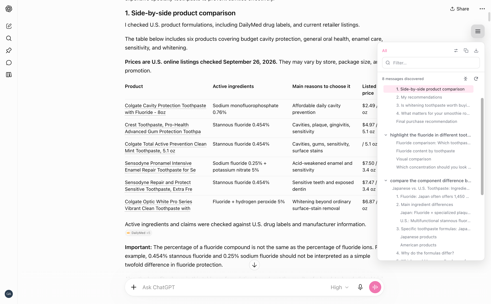

# Turnline

**Find your place in long AI conversations.**

Turnline adds a floating conversation outline to **ChatGPT, Claude, and Gemini**. Jump between prompts and response sections, keep track of what you are reading, and copy or export the content you have discovered.

<p align="center">
  
</p>

## Features

|                             | What you can do                                                                                                                                  |
| --------------------------- | ------------------------------------------------------------------------------------------------------------------------------------------------ |
| **Navigate long chats**     | Jump to a prompt or a heading inside a response. The outline highlights your reading position as you scroll.                                     |
| **Find a section**          | Filter by prompt or section heading text. Collapse individual answer outlines or all turns at once.                                             |
| **Recover ChatGPT history** | Discover older messages by scrolling the page and retain discovered content when ChatGPT removes it from the visible DOM.                        |
| **Copy what you need**      | Copy a prompt, a response, a Q&A pair, or the discovered conversation. Choose plain text, Markdown, or JSON for conversation copies.             |
| **Export a conversation**   | Save the discovered range as Markdown, plain text, or JSON, or use the browser's print dialog to save a PDF.                                     |
| **Make it comfortable**     | Choose System, Light, or Dark appearance, six accent colors or a custom hex color, a custom light-mode background, and text sizes from 10–24 px. |
| **Adjust the outline**      | Show 1–5 heading levels per response or all levels, drag the toggle to a convenient position, resize the sidebar, or enable hover mode to open it on pointer entry. |

All three providers support H1–H6 headings. Outline depth is calculated independently for each response: top-level headings start at level 1, and skipped HTML heading levels do not create empty indentation. ChatGPT also conservatively repairs numbered chapters before calculating depth. The default shows up to four levels; existing depth preferences are retained. Depth and search change what appears in the outline; copying and exporting still use the full detected text with its original heading markers.

## Install from source

Use the Node.js version pinned in [`.nvmrc`](.nvmrc) (24.13.0):

```bash
git clone https://github.com/SN-F-QR/turnline.git
cd turnline
nvm use # If you use nvm
npm ci
npm run build
```

### Chrome, Edge, and Brave

1. Open your browser's extensions page (`chrome://extensions` in Chrome).
2. Enable **Developer mode** and choose **Load unpacked**.
3. Select the repository's `dist/` directory.
4. Open or reload a conversation on ChatGPT, Claude, or Gemini.

After rebuilding, reload the extension on the extensions page and refresh the conversation tab.

### Firefox

```bash
npm run build:firefox
```

In Firefox 128 or later, open `about:debugging`, choose **This Firefox → Load Temporary Add-on**, and select `dist-firefox/manifest.json`. Temporary add-ons need to be loaded again after restarting Firefox.

## Using Turnline

- **Open the outline:** click the floating toggle or press `Cmd + ;` on macOS / `Ctrl + ;` on Windows and Linux.
- **Jump and filter:** click a prompt row or heading to navigate. **Filter…** matches prompt and section heading text within your outline depth setting, ignoring case and leading or trailing search spaces. A matching prompt keeps its answer outline; otherwise, only matching sections appear under their turn. Response body text and answer summaries are not searched. Clear the filter to restore all turns. Use the arrows to collapse answer outlines; filtering preserves their collapsed state. Copies and exports include the full discovered content.
- **Copy:** right-click a turn for **Copy prompt**, **Copy response**, or **Copy Q&A**. Use the top copy button for the discovered conversation; right-click it to select a format.
- **Export:** click the top export button, or right-click it to choose Markdown, PDF, Text, or JSON. ChatGPT exports can ask to scroll through older content first; cancelling the scan stops the export.
- **Customize:** use **H1 / H2 / H3 / All** in the sidebar header to quickly show up to one, two, three, or all heading levels per response. Open **Outline settings** for other depths and appearance options. Preferences are saved locally and shared between tabs in the same browser profile.
- **Move and resize:** press and hold the floating toggle to drag it. Drag the outer sidebar edge to resize from 214–420 px (default: 320 px). Double-click the edge to reset, or focus it and use the Left/Right arrow keys in 10 px steps.

Hover mode is off by default. When enabled, entering the toggle opens the outline and leaving the toggle, sidebar, and menus closes it after a short delay. Clicking the toggle still works.

## How much of a chat is captured?

Turnline reads the conversation DOM. On ChatGPT, opening the outline starts a history scan toward older messages. The scan retains discovered messages, waits for unloaded content, and restores your reading position afterward. You can stop or retry it with the history control. Interacting with the chat takes control back from the scan.

**A finished scan means no more messages were found in the page; it does not guarantee that the provider has returned the entire conversation.** Copy and export describe the discovered range. ChatGPT JSON copies and exports distinguish a finished scan (`scanStatus: "finished"`, `complete: null`) from every unfinished state (`idle`, `scanning`, `partial`, `cancelled`, or `failed`, with `complete: false`). The `reason` field records why the scan stopped or what it is doing. A cancelled or failed export scan stops the download; copying JSON still describes the currently discovered range.

All three providers show the discovered message count, with each prompt and response counted separately. Claude and Gemini use the messages detected on the page; automatic history discovery is currently specific to ChatGPT. Navigation to a message that has been removed from the DOM attempts to load it again on ChatGPT and reports when it is unavailable.

## Privacy and architecture

Conversation parsing and export run in your browser. Turnline has no backend, analytics, or background service worker, and does not call provider conversation APIs. It requires no additional account.

Discovered messages are held in memory for the current conversation, without a persistent chat archive. The extension requests the `storage` permission to save outline preferences locally. Its UI is isolated from the host page in a Shadow DOM.

Built with **React, TypeScript, Vite, Tailwind CSS v4, and Manifest V3**.

## Development

```bash
npm run dev           # Vite development server
npm run typecheck     # Production TypeScript checks
npm run test:ci       # Production/test type checks and unit tests
npx playwright install chromium
npm run test:e2e      # Build Chrome and run offline extension tests
npm run test:check    # All automated checks
npm run build:all     # Build both Chrome and Firefox
npm run package       # Create turnline-chrome.zip and turnline-firefox.zip
```

Browser tests load the real extension against sanitized, offline provider fixtures. They do not access an account. Run Playwright outside a restricted sandbox on macOS. Offline Chromium tests and a Firefox build are supplemented by live-site smoke checks before a release, since provider markup changes over time.

See [contributing.md](contributing.md) for the contribution workflow. Report bugs or suggest features through [Turnline issues](https://github.com/SN-F-QR/turnline/issues).

## Acknowledgements

Turnline is now independently maintained and originated from [Scroll](https://github.com/asker-kurtelli/scroll) by **Asker Kurt-Elli**.

## License

[MIT](LICENSE). The original copyright notice and license terms are preserved, with an additional notice for Turnline contributions.
